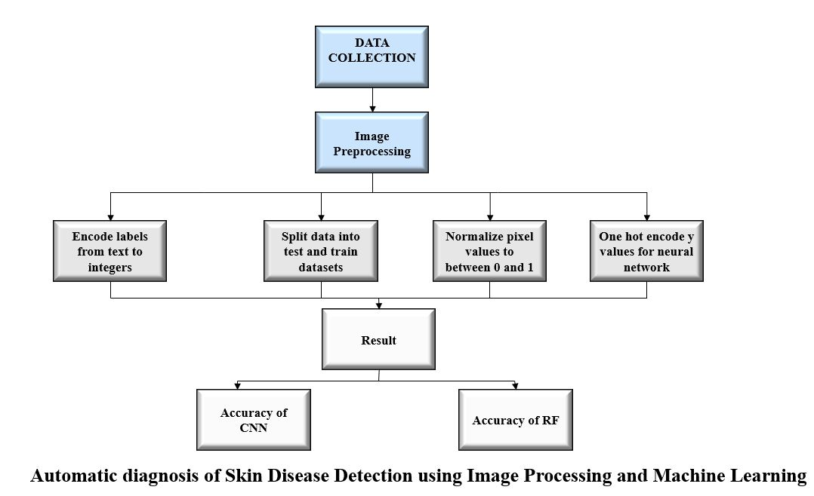
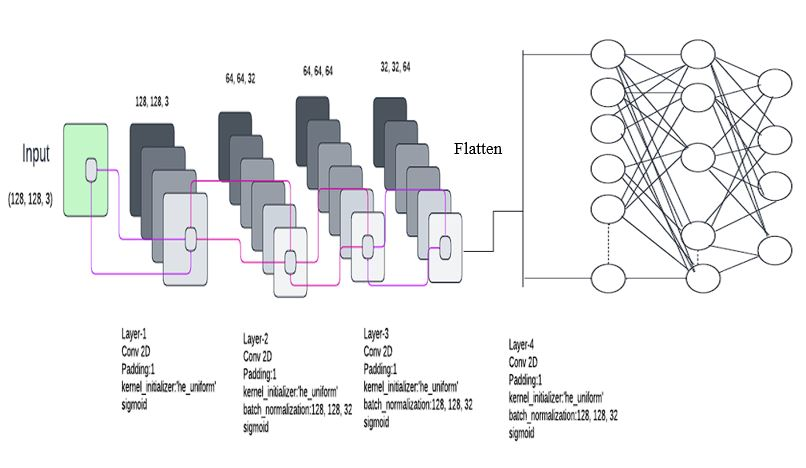
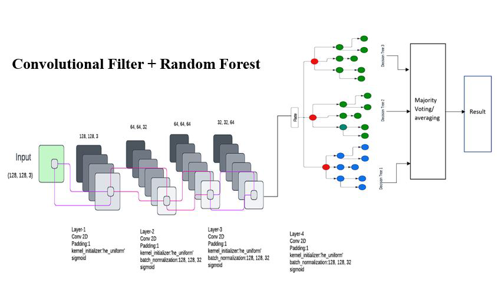

# Automatic-Diagnosis-of-Skin-Disease-using-Image-Processing-and-Machine-Learning
The symptoms of the extremely contagious diseases basal cell carcinoma (BCC), benign keratosis-like lesions (BKL), melanocytic nevi (NV), and melanoma disease are visible. It can be very difficult to diagnose because the lesion pattern resembles that of other cutaneous conditions like herpangina, aseptic meningitis, and poliomyelitis. In order to accurately identify this disease, clinical symptoms are therefore just as important as the pattern and location of skin lesions. In the digital diagnosis of these illnesses, a detection system that combines image processing and machine learning can be very helpful. For the diagnosis and classification of skin diseases, a number of machine learning and deep learning architectures have been suggested, but their accuracy is not favored in medical science, which is why this new system has been implemented. 
# Literature Review
There are a lot of diagnosis processes using machine learning and deep learning has already implemented by researchers but we all know that, Diagnosis of different kinds of disease is very much challenging that’s why to get a perfect result we have worked on it. In this work, we have worked on 4 different diseases which are- Basal Cell Carcinoma (BCC), Benign Keratosis-like Lesions (BKL), Melanocytic Nevi (NV) and Melanoma Disease. 
Here we have create a combination of Image Processing and Machine Learning  and have implemented two different algorithms which are- Convolutional Neural Network (CNN) and Random Forest (RF). 
# Objectives
To diagnose 4 different skin diseases perfectly. 

To implement a new systematic approach with a combination of Image Processing and Machine Learning 

To get better accuracy working on the mixture of two (2) different algorithms, Convolutional Neural Network (CNN) and Random Forest (RF) 

# Methodology
Step:
Image Processing
Image Classification
CNN -Convolutional Neural Network.
DL -Deep Learning.
Random Forest

# CNN -Convolutional Neural Network - Model Diagram

# Convolutional filters + Random Forest - Model Diagram

